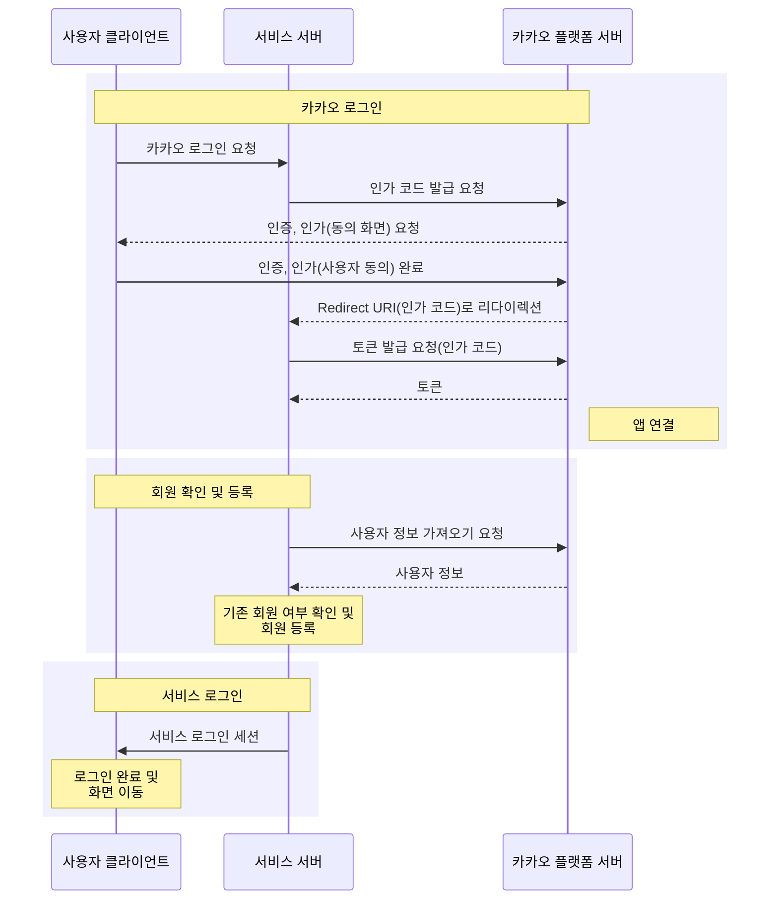

```mermaid
sequenceDiagram
    participant UC as 사용자 클라이언트
    participant SS as 서비스 서버
    participant KS as 카카오 플랫폼 서버
    
    %% 카카오 로그인
    rect rgb(240, 240, 255)
        Note over UC,KS: 카카오 로그인
        UC->>SS: 카카오 로그인 요청
        SS->>KS: 인가 코드 발급 요청
        KS-->>UC: 인증, 인가(동의 화면) 요청
        UC->>KS: 인증, 인가(사용자 동의) 완료
        KS-->>SS: Redirect URI(인가 코드)로 리다이렉션
        SS->>KS: 토큰 발급 요청(인가 코드)
        KS-->>SS: 토큰
        Note right of KS: 앱 연결
    end

    %% 회원 확인 및 등록
    rect rgb(240, 240, 255)
        Note over UC,SS: 회원 확인 및 등록
        SS->>KS: 사용자 정보 가져오기 요청
        KS-->>SS: 사용자 정보
        Note over SS: 기존 회원 여부 확인 및<br/>회원 등록
    end

    %% 서비스 로그인
    rect rgb(240, 240, 255)
        Note over UC,SS: 서비스 로그인
        SS->>UC: 서비스 로그인 세션
        Note over UC: 로그인 완료 및<br/>화면 이동
    end
```

